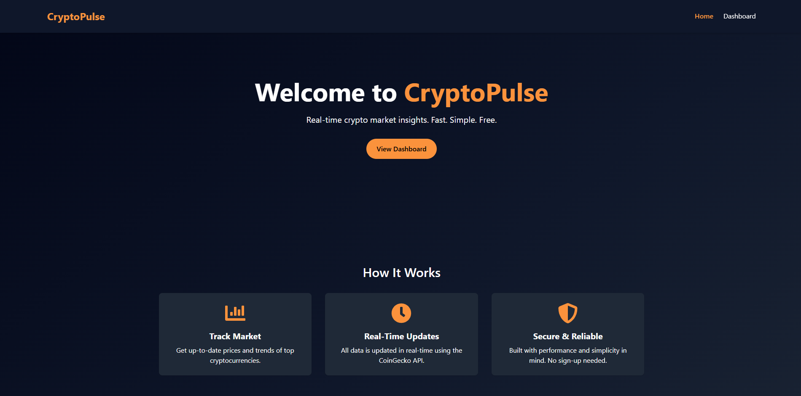
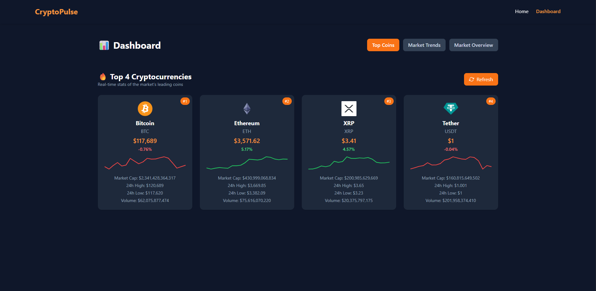

# 📊 CryptoPulse

CryptoPulse is a modern and responsive cryptocurrency dashboard built with React. It allows users to view live crypto market data, analyze trends, and explore top-performing coins using real-time data from the [CoinGecko API](https://www.coingecko.com/en/api).

## 🚀 Features

- 🌐 Live crypto market data (top coins, full market overview)
- 📈 Sparkline chart trends for price movement
- 🔍 Coin ranking and key metrics
- 💡 Dynamic tabbed interface (Top Coins, Market Trends, Market Overview)
- 📊 Interactive charts using Chart.js
- 📄 Export market data to CSV
- ⚡ Refresh market data manually
- 🧠 Responsive design
- 🎯 Current route highlighting
- 🎞️ Card animation with Framer Motion
- 📱 Mobile navigation menu (hamburger-style)

---

## 📸 Screenshots




---

## 🛠️ Tech Stack

- **React.js**
- **Tailwind CSS** – for rapid UI styling
- **Axios** – for API requests
- **React Router DOM** – for routing
- **Chart.js + react-chartjs-2** – for charts
- **Framer Motion** – for animations
- **CoinGecko API** – for crypto data

---

## 📦 Installation

Clone the repo and install dependencies:

```bash
git clone https://github.com/Dev-Rodiyat/CryptoPulse.git
cd CryptoPulse
npm install
````

---

## ▶️ Running the App

```bash
npm start
```

The app will run locally at `http://localhost:5173`.

---

## 🌐 API Used

This project uses the **CoinGecko Public API** for fetching cryptocurrency market data:

* [Top Coins Endpoint](https://www.coingecko.com/api/documentation)
* [Market Overview](https://api.coingecko.com/api/v3/coins/markets)
* [Coin Chart Data](https://api.coingecko.com/api/v3/coins/{id}/market_chart)

No API key is required.

---

## 📁 Folder Structure

```
src/
│
├── components/         # Reusable components (CryptoCard, ChartSection, etc.)
├── pages/              # Page views like Dashboard
├── services/           # API utilities (CoinGecko API functions)
├── App.jsx             # Main app structure
├── main.jsx            # Entry point
```

---

## ✅ Upcoming Improvements (Optional)

* Add coin detail page
* Implement user authentication
* Add light/dark theme toggle
* Add portfolio tracker feature

---

## 🧑‍💻 Author

* **Rodiyat Olajide** – [@yourgithub](https://github.com/Dev-Rodiyat)
